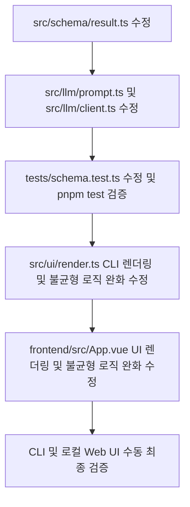

# Handoff 01: Explainable Overfit Analysis 구현 계획 (v1.1)

본 세션에서는 설계 오버핏 분석 시 AI가 어떠한 경로로 맥락을 파악하고 가정을 두었는지 투명하게 가시화하는 작업과 함께, 분석 결과가 '적정'일 때 과도한 규모 불균형 경고가 뜨는 모순을 완화하는 패치 작업을 계획했습니다.

## 📌 조사 요약

1. **대상 컴포넌트**
   - **백엔드/스키마**: `src/schema/result.ts` (Zod 스키마), `src/llm/prompt.ts` (시스템 프롬프트), `src/llm/client.ts` (라우터 API 폴백 모의 데이터)
   - **출력/렌더러**: `src/ui/render.ts` (CLI/마크다운 렌더러 - 규모 불균형 경고 조건 완화 포함)
   - **프론트엔드**: `frontend/src/App.vue` (결과 컴포넌트, Vue 타입 정의 및 규모 불균형 경고 조건 완화)
   - **테스트**: `tests/schema.test.ts` (스키마 테스트 케이스)

2. **추가 필드 정의**
   - `detected_category`: string - 감지된 시스템 설계 종류 (예: "Web API", "CLI Tool")
   - `analysis_approach`: string - AI가 문서에서 어떤 단서나 섹션을 기반으로 맥락을 파악했는지 설명
   - `inferred_assumptions`: string[] - 구체적인 수치(트래픽, 사용자 수 등)가 생략된 경우 유추한 가정들

3. **규모 불균형 경고 로직 패치**
   - `verdict === "적정"` (complexity_score <= 4) 일 경우, 문제와 해결책의 갭이 2 이상이더라도 위험(🚨) 경고를 표기하지 않고 "적정 수준의 해결책(허용 범위)"으로 출력하도록 수정.

## 🛠️ EXECUTION GRAPH (구현 계획)



1. **Step 1: 스키마 & LLM 프롬프트 & 클라이언트 수정**
   - `src/schema/result.ts`에 세 필드 추가.
   - `src/llm/prompt.ts`에 프롬프트 지침 및 응답 JSON 형태 갱신.
   - `src/llm/client.ts`에 폴백 모의 데이터 갱신.
2. **Step 2: 테스트 및 CLI 렌더러 수정**
   - `tests/schema.test.ts`에 mock 데이터 갱신 및 유효성 테스트 실행.
   - `src/ui/render.ts`에서 CLI 터미널 출력 및 마크다운 포맷 출력에 분류, 접근법, 유추 가정 리스트가 렌더링되도록 구현.
   - `getSizeGapWarning`에 `verdict` 파라미터를 추가하여 "적정" 판정 시 경고 수준을 완화.
3. **Step 3: 프론트엔드 UI 연동**
   - `frontend/src/App.vue`의 `OverfitResult` 인터페이스 갱신.
   - UI 결과 영역 상단에 '시스템 분류', '분석 방식', '유추 및 가정' 데이터 카드 추가.
   - `getSizeGapClass`, `getSizeGapIcon`, `getSizeGapMessage`가 `verdict`를 전달받아 `verdict === '적정'`인 경우 `gap-ok` / "균형 잡힌 설계(허용 범위)"로 판단하게 수정.
4. **Step 4: 로컬 통합 검증**
   - `pnpm lint`, `pnpm typecheck`, `pnpm test` 검사.
   - CLI 로컬 실행 및 웹 서버 기동하여 정상 렌더링 및 경고 완화 확인.

## ⚠️ 리스크 및 예산
- **Complexity Budget**: 수정 파일 6개, 생성 파일 0개.
- **Kill Conditions**: LLM 응답이 불안정하여 JSON 파싱 실패가 발생하는 경우, 또는 `pnpm test` 실패 시 수정 중단.

## 🔍 E2E 검증 시나리오
1. **CLI 실행**:
   ```bash
   pnpm dev -- check examples/simple-email-spec.md
   ```
   출력 결과에 설계 분류, 분석 접근법, 유추된 가정들이 표기되며, 적정 설계에 대해 규모 불균형 🚨 경고 대신 ✓ 기호 또는 완화된 메시지가 출력되는지 확인.
2. **Web UI 실행**:
   ```bash
   pnpm dev -- ui --port 3000
   ```
   심플한 샘플(적정)을 로드하여 분석했을 때, 결과 화면에 새로운 메타 카드들이 노출되고 "규모 불균형" 🚨 대신 "균형 잡힌 설계" ✅ 가 표시되는지 검증.

---

## 🚀 FIRST ACTION MUST (다음 세션 즉시 실행 사항)
- **대상**: [result.ts](file:///Users/studio-server/srv/overfit-checker/src/schema/result.ts#L43-L54)
- **액션**: `detected_category`, `analysis_approach`, `inferred_assumptions` 필드를 Zod 스키마에 구현하기.
